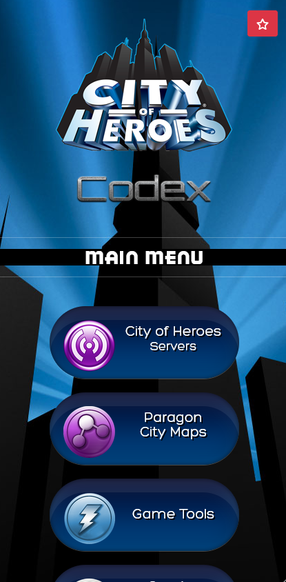

# City of Heroes - Codex

A (mobile-friendly) Progressive Web App for City of Heroes

Hosted here : [https://coh.rf.gd/](https://coh.rf.gd/)

- VidiotMaps
- Games Tools
  - Enhancement Shopping List (Training/SO/DO)
  - Links to other tools
  - Badger - [https://n15g.github.io/badger/](https://n15g.github.io/badger/)
  - BindControl - [https://github.com/emersonrp/bindcontrol](https://github.com/emersonrp/bindcontrol)
  - City of Badgers - [https://cityofbadgers.com/](https://cityofbadgers.com/)
  - City of Data - [https://cod.uberguy.net/](https://cod.uberguy.net/)
  - MIDS Reborn - [https://midsreborn.com/](https://midsreborn.com/)
  - MOD Installer - [https://mods.cityofheroes.dev/](https://mods.cityofheroes.dev/)
  - City of Heroes - Comics & Fanzines
  - City of Heroes - Game Manuals
  - City of Heroes - Story Bibles
  - Links to COH Servers
  - Link to original Paragon Wiki

- Software Used :
  - UberGallery - The simple PHP photo gallery - Created by, [Chris Kankiewicz](http://www.ChrisKankiewicz.com)
  - FontAwesome - [https://fontawesome.com/](https://fontawesome.com/)
  - Bootstrap - [https://getbootstrap.com](https://getbootstrap.com)
  - HTML
  - CSS
  - Javascript
  - JQuery
  - PHP

- Requirements
  - Apache2 or Nginx
  - MySQL
  - PHP 7.4+

- Instructions
  - Clone repository
  - Import codex.sql into a MYSQL db
  - Update /enchancements/enhancement_db.php with DB information

## Backstory
I put this together back when City of Heroes re-emerged in 2017. 
My coding skills were still pretty basic when I made it, but have grown somewhat since then.
I still plan to tinker with it and clean up some of the repetitive CSS. 
